# Overview
<table border="0" cellspacing="0" cellpadding="0">
  <tr>
    <td valign="top" width="20%">
    </img>
    </td>
    <td valign="top">
  This project is a simple exercise aimed at demonstrating some good practices in iOS app development. While it replicates a very tiny subset of features of the ClearScore app, it is in no way affiliated nor endorsed by the ClearScore company and can not be used for anything order than for demonstration purposes.
    </td>
  </tr>
</table>

# Minimum iOS 13 Target
The app is targetted at devices running iOS 13 or newer:  
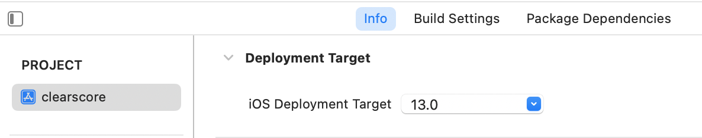

# Launch screen and icon using ClearScore logo
<table border="0" cellspacing="0" cellpadding="0">
  <tr>
    <td valign="top" width="20%">
      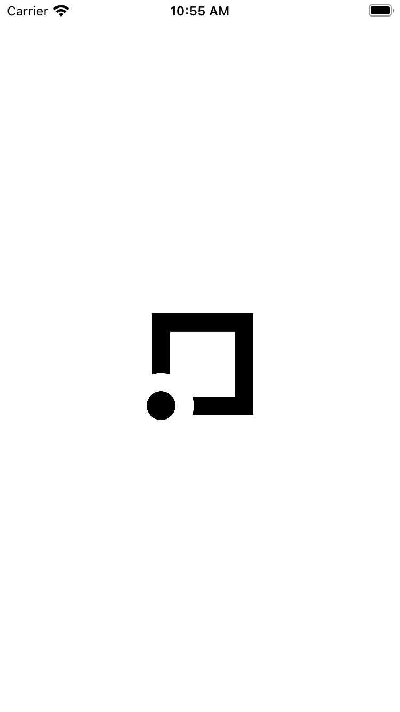</img>
    </td>
    <td valign="top">
    This was added to make the app appear more refined when testing it out simulators or on users' phones. Please note that the author makes no representation of collaboration or affiliation between this project and the ClearScore company, neither is the app indicated to be considered for real-world use.
    </td>
  </tr>
</table>

# Localized strings
The project sets up an easily extensible internationalization (i18n) configuration to ease incremental localization (l10n) of the app in the future, using the standard [`Localizable.strings`](clearscore/ViewUtils/en.lproj/Localizable.strings) files:  
[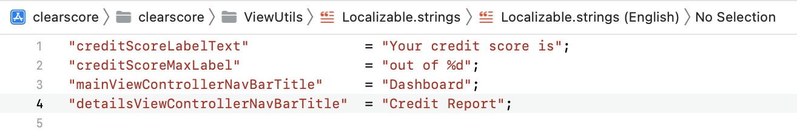](clearscore/ViewUtils/en.lproj/Localizable.strings)

but then wrapping the strings contained therein in `enum`s to ensure compile-time access safety anywhere else in the app:  
[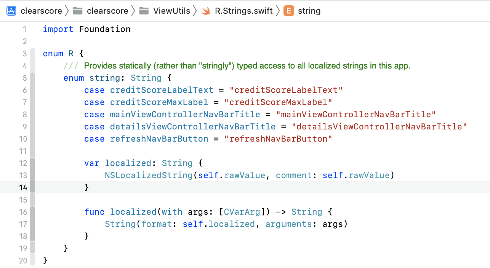](clearscore/ViewUtils/R.Strings.swift)

Usage in views and view controllers (Android developers will notice the "R" idiom 😊):  
[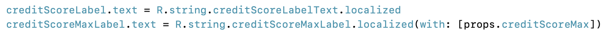](clearscore/MainView/MainView.swift) 

No third-party tools (e.g. SwiftGen) required.

# Storyboardless UIKit-based UI Development
The app's user interface is built with the UIKit framework but absolutely uses no Storyboard component. The UI elements are constructed programmatically using standard UIKiit APIs—UIView and UIViewController subclasses.

# SwiftUI-style XCode Design Canvas Previews

<table border="0" cellspacing="0" cellpadding="0">
    <tr>
        <td valign="top" width="20%">
            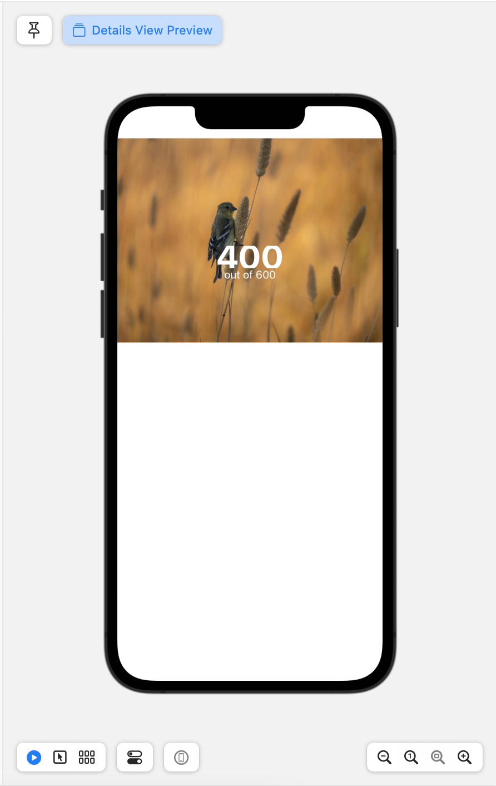</img>
        </td>
        <td valign=top>
    To speed up development, the project includes debug-only [SwiftUI framework code](clearscore/ViewUtils/ViewPreviewers.swift) constructs that set up visual previews of the user interface elements constructed with the code written, right inside the Xcode IDE, and featuring real-time visual updates as changes are made to the code, quite like how SwiftUI development works.
        </td>
    </tr>
</table>

# Decluttered UIViewControllers
While the UI is constructed in code, some good practices are used:
- proper separation of concerns and adherence to single responsibility principle, by moving the entire UI elements and layout code into subclasses of the `UIView` UIKit class. These subclasses are then "inflated" (ala Android UI XML inflation) in the `loadView()` methods of host `UIViewController` subclasses that represent screens of the app:  
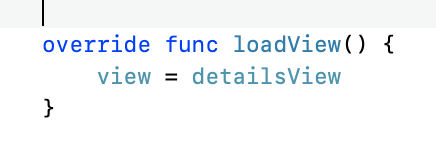

- in mimicing modern reactive UI paradigms, particularly ReactJS, it uses idioms such as the naming of a `render` function for the UIView, which takes a `Props` argument and provides similar functionality of painting state changes to the screen: `UI = fn(state)`:  
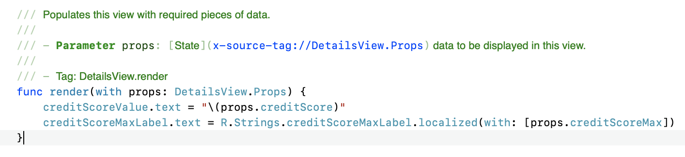

# Unidirectional Data Flow—"State down, events up"
- While using the MVVM pattern, but adhering to UDF principles, the view model exposes read-only observable properties that view controllers can bind to;
- The views define UI state structures, `<UIVIew>.Props`, that containing `UIViewController`s can arrange those observable view model properties into while updating the views that display them on screen:  
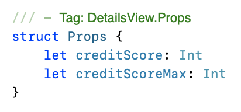

- The views or view controllers cannot directly reach into the view model and modify the state held in it, rather it raises UI events and invokes methods on the view model, triggering (possibly asynchronous) operations that ultimately modifies the state held in the view model and notifying the view of this changes.

# Dependency Inversion Principle (aka Dependency Injection) and Protocol-Driven Development
The codebase is architected to pass in certain dependencies via initializers or as function arguments, rather than instantiating these within the classes and functions that need them.
- This makes the codebase so easy to exercise automated test on: given `x` input, assert `y` output—no testing of implementation specifics;
- Combined with Protocol-driven development it allows for switching concrete dependencies (which must conform to an expected protocol) according to different runtime requirements, e.g. passsing in mocks of dependencies not under test during automated tests, as indicated in the [automated tests section further below](#automated-tests).

# Simple Unified Remote Network Layer, built on  Modern Swift concurrency—Async, @MainActor
- Implements a tiny [utility code lib](clearscore/RemoteServiceAPI/RestApiUtil.swift) which uses Swift generics to make it reusable for invoking different remote HTTP endpoints and returning different JSON-decodable entities from the remote API calls;
- No third-party dependency (no ~~Alamofire~~) involved, just the standard `URLSession` framework;
- Currently supports the `HTTP GET` method, but can be easily extended to support various HTTP methods and headers as the app's funtionality expands;
- Uses the new Swift `async` and `Task` asynchronous (Concurrency) code constructs, allowing for easy-to-read and concise code--no "completion callback" closures required.
- A [`RemoteServiceAPIProtocol`](clearscore/RemoteServiceAPI/RemoteServiceAPI.swift) is defined to provide a layer to be invoked by the rest of the app to fetch data from any endpoint. Individual methods can be added in this protocol intended to invoke specific endpoints and fetch data needed by different parts of the app, using the [utility network library](clearscore/RemoteServiceAPI/RestApiUtil.swift) mentioned above. Using a protocol to define this layer allows for providing different concrete implementations of this functionality, and this is the basis for making the app quite testable as explained in the [dependency inversion principle](#dependency-inversion-principle-aka-dependency-injection-and-protocol-driven-development) and [automated tests](#automated-tests)s in this document.

# Automated Tests
This project wouldn't be said to have demonstrated best practices without including automated—unit and UI—tests.
## Unit Tests:
- Uses the standard **XCTest** framework for unit tests;
- Demonstrates testing of the new Swift Async concurrency code constructs;
- Takes advantage of the dependency inversion principle and protocol-driven pattern used in the code to swap-in and inject a mock API object to ease testing functionality.

## UI Tests:
- Uses standard `UIView` *AccessibilityIdentifier* attribute to reference UI elements on screen, rather than static texts that may change depending on locale of the devices;
- Uses the [Page Object](https://martinfowler.com/bliki/PageObject.html) pattern for a more expressive and intuitive test codebase;
- Consolidates mock/test data code into [resuable](clearscore/TestFixtures/RemoteServiceAPIMock.swift) [test fixtures](clearscore/TestFixtures/CreditScoreAPIResponse%2BFixture.swift) used which are then explicitly excluded from the app's release builds by configuring Xcode build settings to exclude them;
- Uses runtime `launchArguments` in the `XCUITestCase` to launch the app:  
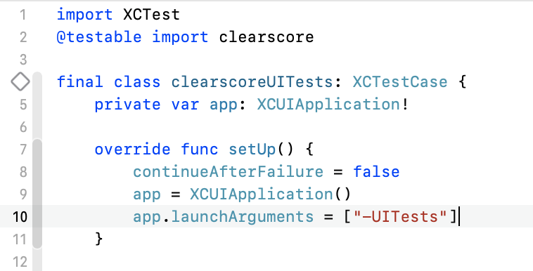  
and then checks for these `launchArguments` in the [`SceneDelegate scene(...)` function](clearscore/SceneDelegate.swift) to enable switching app dependencies to mocks for launching the app for testing on simulators or real devices:  
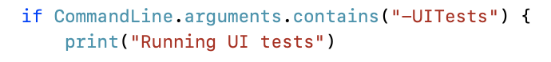

# Code Hygiene:
Guided by standard Swift linting conventions, the codebase aims to be as neat and easy to read as possible:
- The codebase does not exceed the Xcode standard 120 columns horizontal line length limit;
- Functions with multiple parameters have these parameters declared on individual lines;
- Includes code header docs, using standard annotation including linking to referenced objects from within the documentation, making it easy to navigate within the codebase via the documentation;
- Organizing code files and resources by (user-facing) features, complete with all the “layers” that comprise each feature—views, view controllers, view models, extensions, related Utils, etc—making it easy to break codes into separate Swift modules if and when code gets larger in the future.